# Meepo Architecture

## Overview

Meepo is a 5-crate Rust workspace implementing a local AI agent for macOS. It connects Claude to messaging channels (Discord, Slack, iMessage), gives it access to 25 tools (including web search and sub-agent delegation), and maintains a persistent knowledge graph.

## Crate Dependency Graph

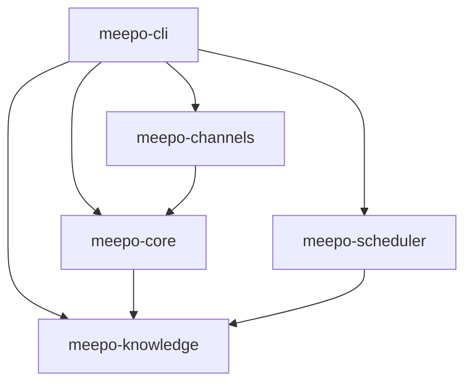

| Crate | Purpose | Key Types |
|-------|---------|-----------|
| `meepo-cli` | Binary entry point, config, subcommands | `Cli`, `MeepoConfig` |
| `meepo-core` | Agent loop, API client, tool system, orchestrator | `Agent`, `ApiClient`, `ToolRegistry`, `TaskOrchestrator`, `TavilyClient` |
| `meepo-channels` | Channel adapters and message routing | `MessageBus`, `MessageChannel` |
| `meepo-knowledge` | SQLite + Tantivy persistence | `KnowledgeDb`, `KnowledgeGraph`, `TantivyIndex` |
| `meepo-scheduler` | Watcher runner and event system | `WatcherRunner`, `Watcher`, `WatcherEvent` |

## Message Flow

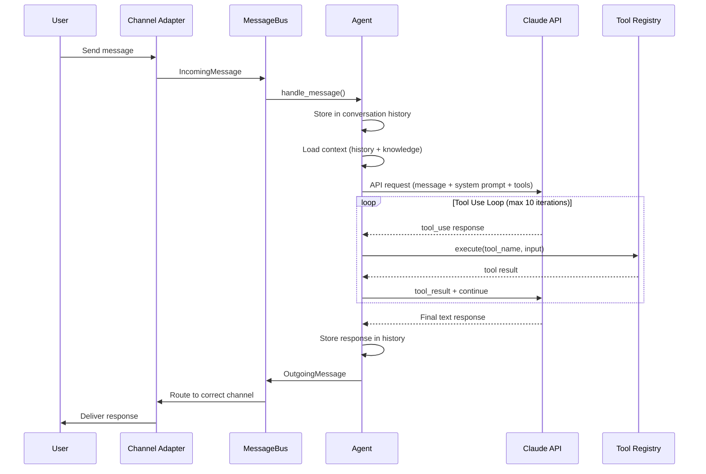

## System Architecture

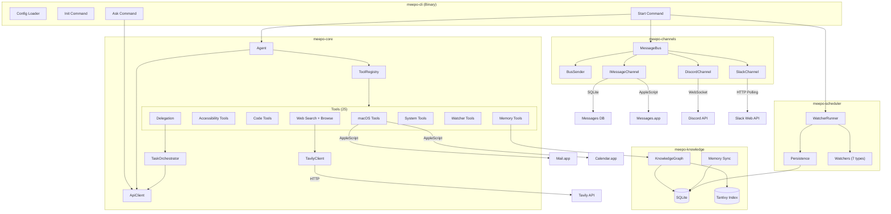

## Event Loop

The main event loop runs in `cmd_start()` using `tokio::select!` across four sources:

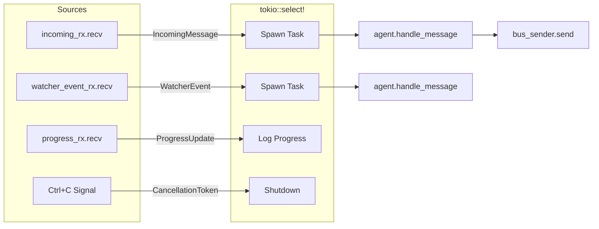

The bus is split into a receiver (`mpsc::Receiver<IncomingMessage>`) and an `Arc<BusSender>` to allow concurrent send/receive without borrow conflicts.

## Tool System

Tools implement the `ToolHandler` trait and are registered in a `ToolRegistry` (HashMap-backed). The agent's API client runs a tool loop that executes tools until Claude returns a final text response or hits the 10-iteration limit.

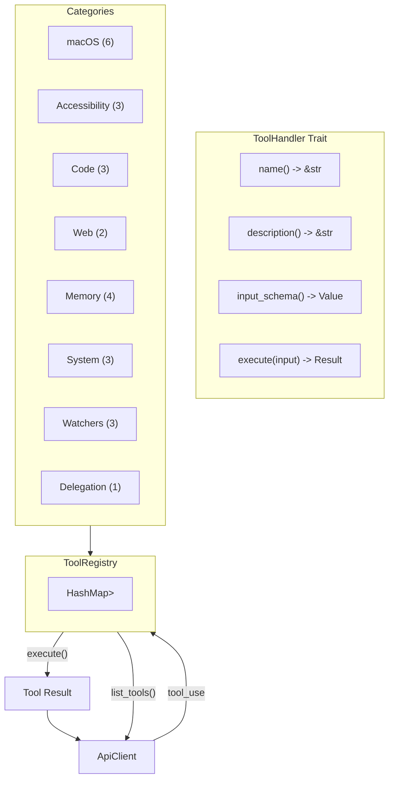

### Tool List

| Tool | Description | Implementation |
|------|-------------|----------------|
| `read_emails` | Read recent emails from Mail.app | AppleScript via `osascript` |
| `read_calendar` | Read upcoming calendar events | AppleScript via `osascript` |
| `send_email` | Send email via Mail.app | AppleScript (sanitized input) |
| `create_calendar_event` | Create calendar event | AppleScript (sanitized input) |
| `open_app` | Open macOS application | `open -a` command |
| `get_clipboard` | Read clipboard contents | `pbpaste` command |
| `read_screen` | Read focused app/window info | AppleScript accessibility |
| `click_element` | Click UI element by name | AppleScript accessibility |
| `type_text` | Type text into focused app | AppleScript keystroke |
| `write_code` | Delegate coding to Claude CLI | `claude` CLI subprocess |
| `make_pr` | Create GitHub pull request | `git` + `gh` CLI |
| `review_pr` | Analyze PR diff for issues | `gh pr view` + diff analysis |
| `web_search` | Search the web via Tavily | Tavily Search API (conditional) |
| `browse_url` | Fetch URL content | Tavily Extract → raw `reqwest` fallback |
| `remember` | Store entity in knowledge graph | SQLite + Tantivy insert |
| `recall` | Search entities by name/type | SQLite query |
| `search_knowledge` | Full-text search knowledge graph | Tantivy search |
| `link_entities` | Create relationship between entities | SQLite insert |
| `run_command` | Execute shell command (allowlisted) | `sh -c` with 30s timeout |
| `read_file` | Read file contents | `tokio::fs::read_to_string` |
| `write_file` | Write file contents | `tokio::fs::write` |
| `create_watcher` | Create a background monitor | SQLite + tokio task |
| `list_watchers` | List active watchers | SQLite query |
| `cancel_watcher` | Cancel an active watcher | CancellationToken |
| `delegate_tasks` | Spawn sub-agent tasks | TaskOrchestrator |

## Knowledge Graph

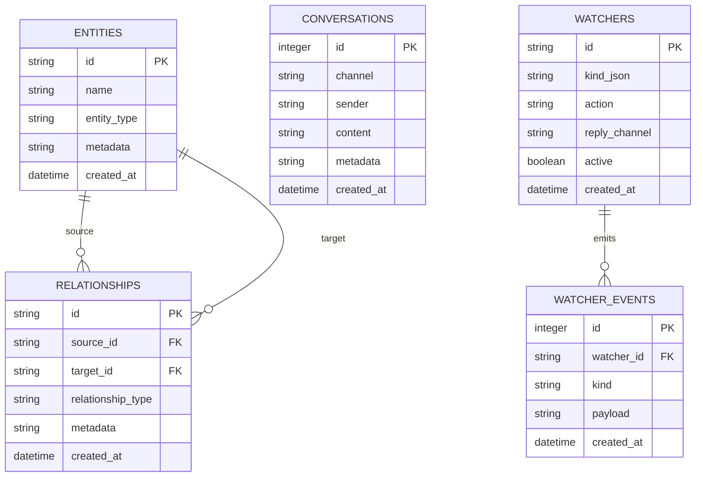

The knowledge layer has two backends:
- **SQLite** (`KnowledgeDb`) — Stores entities, relationships, conversations, and watchers with indexed queries
- **Tantivy** (`TantivyIndex`) — Full-text search index over entity content, returning relevance-ranked results

`KnowledgeGraph` combines both, indexing entities in Tantivy on insert and delegating searches to the appropriate backend.

## Watcher System

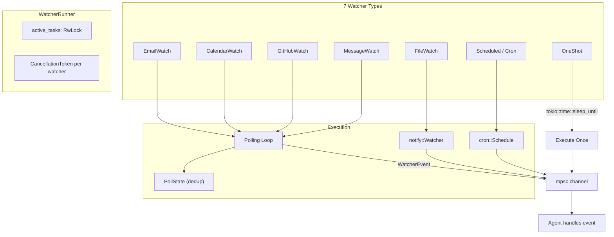

Watchers run as independent tokio tasks managed by `WatcherRunner`. Each has a `CancellationToken` for graceful shutdown. Polling watchers use `PollState` with `HashSet<u64>` for deduplication across cycles.

## Channel Adapters

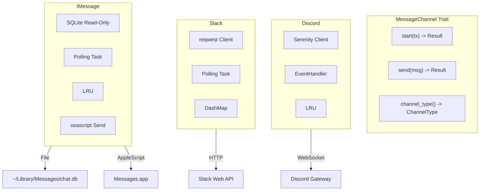

| Channel | Connection | Receive | Send | Reply Tracking |
|---------|-----------|---------|------|----------------|
| Discord | WebSocket via Serenity | EventHandler callback | HTTP via `channel_id.say()` | LRU cache (1000 entries) |
| Slack | HTTP polling (configurable interval) | `conversations.history` | `chat.postMessage` | DashMap user->channel |
| iMessage | SQLite polling of chat.db | Read-only query by ROWID | AppleScript `send` command | LRU cache (1000 entries) |

## Sub-Agent Orchestrator

The `delegate_tasks` tool enables Meepo to break complex requests into focused sub-tasks. Each sub-task runs as an independent agent with a scoped subset of tools.

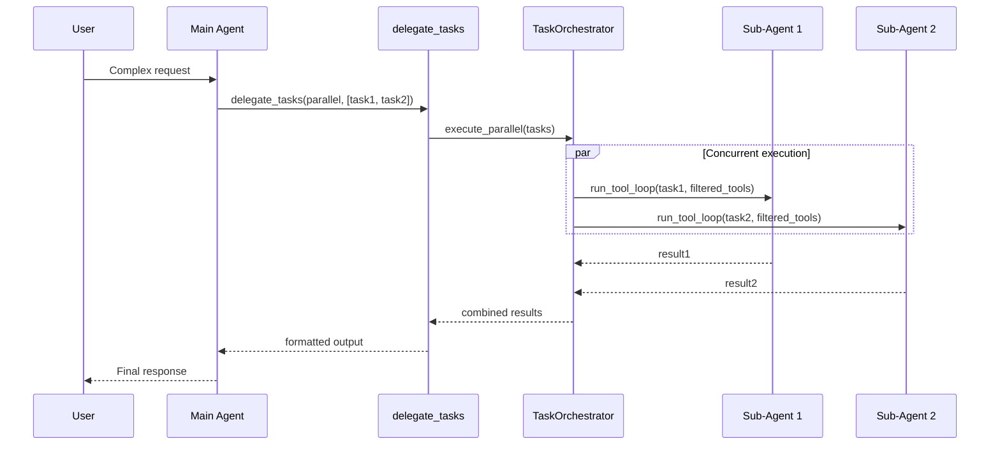

**Two execution modes:**

| Mode | Behavior | Use Case |
|------|----------|----------|
| `parallel` | Blocks until all sub-tasks complete, returns combined results | Multi-part research, data gathering |
| `background` | Fire-and-forget, reports progress asynchronously | Long-running work the user checks on later |

**Key design decisions:**
- **`FilteredToolExecutor`** wraps `ToolRegistry` to give each sub-agent a scoped tool list — `delegate_tasks` is always stripped to prevent recursive nesting
- **`OnceLock`** pattern resolves circular dependency: the tool needs a registry reference, but the registry contains the tool
- **`Semaphore`** enforces `max_concurrent_subtasks` to prevent resource exhaustion
- **Atomic CAS loop** for background group counting under contention

## Web Search

Web search is powered by the Tavily API with graceful degradation — everything works without a Tavily key, just without `web_search` and with raw HTML fallback for `browse_url`.

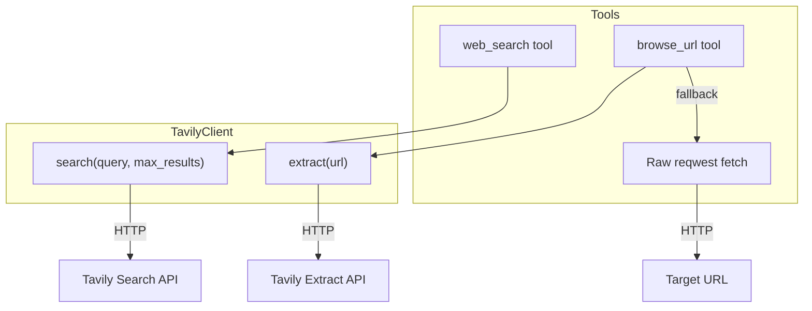

**Registration logic:** At startup, if `TAVILY_API_KEY` is set, a shared `TavilyClient` is created. `web_search` is registered only when the client exists. `browse_url` is always registered — it tries Tavily Extract first and falls back to raw fetch.

## Security Model

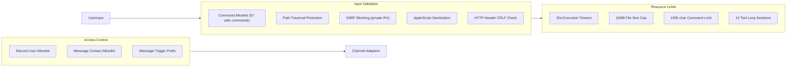
